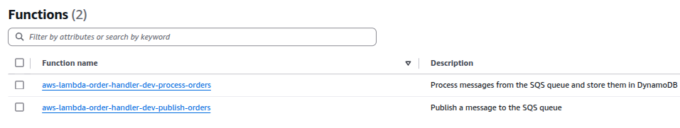

<h1 align="center">
  <br/>
  
  AWS Lambda Order Handler
</h1>

<p align="center">
  

  
  
  <a href="https://github.com/LucasPereiraMiranda/aws-lambda-order-handler/commits/main">
    
  </a>

  <a href="https://github.com/LucasPereiraMiranda/aws-lambda-order-handler/issues">
    
  </a>

  <a href="https://github.com/LucasPereiraMiranda/aws-lambda-order-handler/issues">
    
  </a>
</p>

<br>


## 🚀 Techs

AWS Lambda Order Handler was developed with these technologies:

- [Node.js](https://nodejs.org/)
- [NPM](https://www.npmjs.com/)
- [DynamoDB](https://aws.amazon.com/dynamodb/)
- [Serverless Framework](https://www.serverless.com/)
- [AWS SQS](https://aws.amazon.com/sqs/)
- [AWS Lambda](https://aws.amazon.com/lambda/)
- [TypeScript](https://www.typescriptlang.org/)
- [Zod](https://zod.dev/)

## 💻 Project

This project is a serverless application with two functions, designed to publish and process orders efficiently under high load, as described above:


The developed functions are the following:



- publishOrders lambda function (API Gateway → SQS Producer):
  - Exposes an HTTP endpoint via API Gateway to accept new orders.
  - Validates incoming payloads to ensure data integrity.
  - Publishes the order message to an SQS queue, enabling asynchronous processing.

- processOrders lambda function (SQS Consumer → DynamoDB Writer):
  - Listens to the SQS queue and processes incoming order messages.
  - Checks for idempotency before inserting orders into DynamoDB.
  - Handles potential failures and utilizes Dead Letter Queues (DLQs) to prevent message loss.


The SQS queue setup includes a dead letter queue for enhanced resilience, as described above:


## 💻 Idempotency handler strategy

To prevent duplicate order processing, the system ensures idempotency by using unique order identifiers stored in DynamoDB.
If an order with the same orderId already exists, it is ignored, ensuring that retries or duplicate events do not result in inconsistent data.


## :boom: Installation

Follow these steps to set up the project with the Serverless Framework:

```bash
# Clone this repo
$ git clone git@github.com:LucasPereiraMiranda/aws-lambda-order-handler.git

# Navigate to the project directory
$ cd aws-lambda-order-handler

# Use Node 22 with .nvmrc reference
$ nvm use

# Install dependencies
$ npm install

# Install Serverless Framework globally
$ npm install -g serverless

# Deploy the serverless services to AWS after define your credentials with aws cli
$ serverless deploy

```

## License

[MIT](LICENSE)